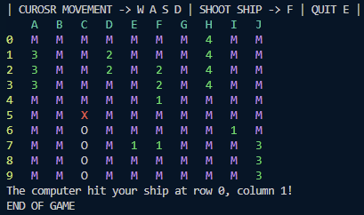

# Battleships Game
<h2>Description</h2>
The Battleships Game is a classic strategy game implemented in a command-line interface (CLI) environment. The game allows players to compete against the computer by strategically placing their ships on a grid and attempting to sink the opponent's ships. The game continues until one player runs out of ships.

<h2>Features</h2>
Interactive gameplay: Players can take turns placing their ships and guessing the positions of the opponent's ships.
Grid-based interface: The game is played on a grid, allowing players to select specific coordinates for their moves.
Ship placement: Players can strategically place their ships on the grid before the game begins.
Hit and miss feedback: After each guess, the game provides feedback on whether the guess was a hit or a miss.
Ship sinking: When a player successfully hits all the positions of an opponent's ship, that ship is considered sunk.
End game condition: The game continues until either the player or the computer runs out of ships.
  

<h2>Usage</h2>

To play the Battleships Game, follow these steps:

Run the battleships.sh script.
Use the option -p to start the game.
Follow the instructions to place your ships on the grid.
Take turns guessing the positions of the opponent's ships.
Continue until one player runs out of ships.
<h2>Options</h2>
-a: Display author information.
-p: Start the game.
-h: Display help information.
<h2>Author</h2>

MikyTuberr / Piotr

Email: pio1342@gmail.com

<h2>Bug Reports</h2>
Please contact pio1342@gmail.com to report any bugs, errors, or typos.

<h2>License</h2>
This project is licensed under the Apache License Version 2.0. See the LICENSE file for more information.
